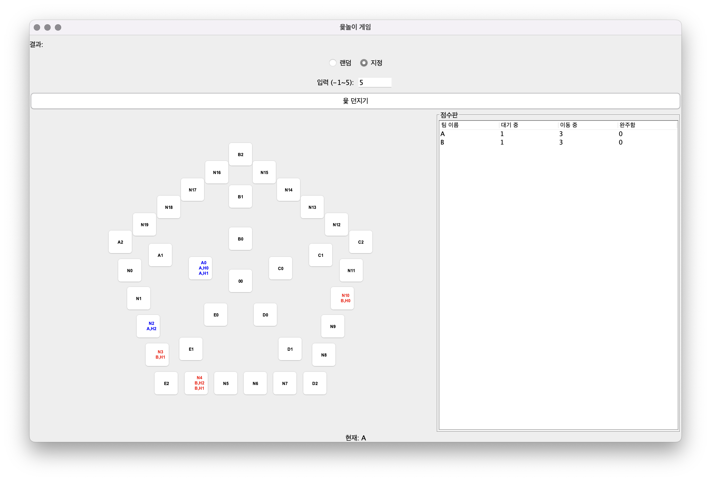
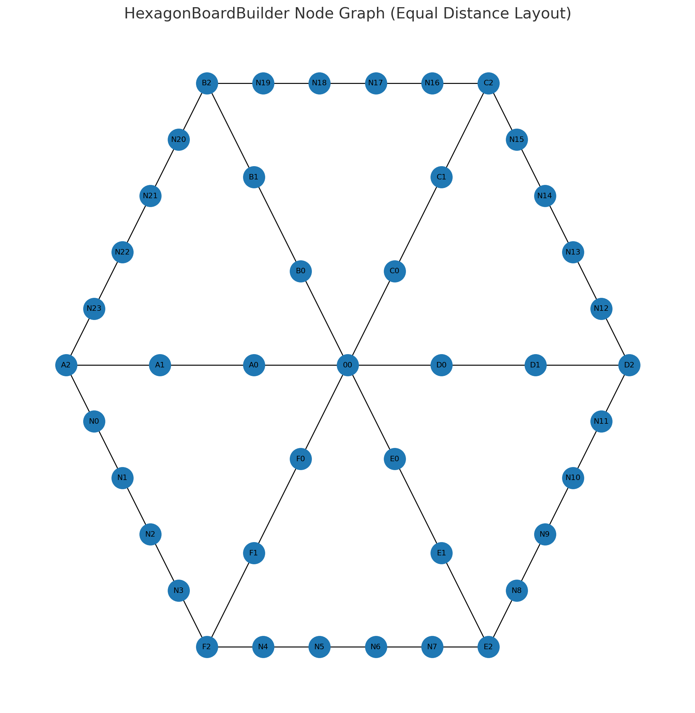
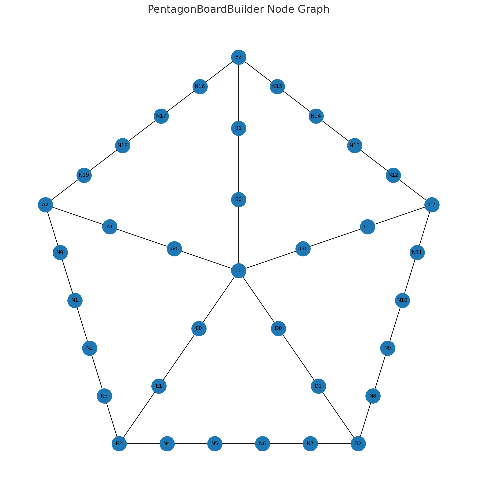
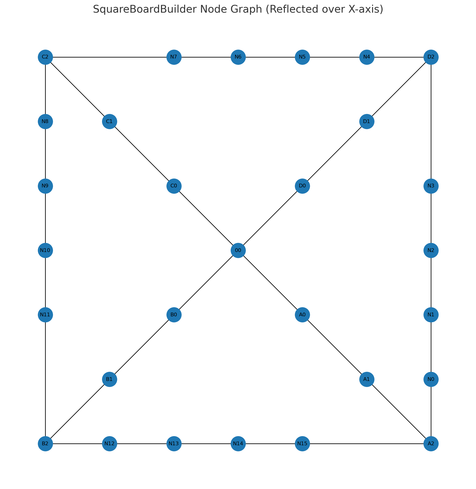

<h2 align="center"> 🎲윷놀이🎲 </h2>     
<div align="center">

   
<br>

소프트웨어공학 2분반 6조 팀프로젝트의 `README.md`에 오신걸 환영합니다!  
4, 5, 6각형 판을 지원하며, 플레이어당 5개 이하의 말을 지정하여 윷놀이 게임을 할 수 있습니다.  
본 프로젝트는 **OOAD** 구조로 각 클래스가 명확하게 분리되어 유지보수 및 확장이 쉬운 구조로 설계되었습니다.

<br>



**Team Members**  
| **김희서** | **박도연** |  **이정연** | **여지원** | **임정원** |
|:-----:|:-----:|:------:|:-----:|:-----:|
||  |  |  |                                           | 
|[dearHS](https://github.com/hs03290811)|[dp44rk](https://github.com/dp44rk)|[yeonnnnni](https://github.com/yeonnnnni)|[yjione](https://github.com/yjione)|[jeongwon](https://github.com/garden0324)|


</div>  


 <h2 align="center">  📁 프로젝트 구조  </h2>   

```
.
├── README.md
├── caw1.iml
├── docs
│   ├── *.md
│   ├── Builder_images
│   │   ├── hexagon_board.png
│   │   ├── pentagon_board.png
│   │   └── square_board.png
└── src
    ├── App.java
    ├── builder
    │   ├── BoardBuilder.java
    │   ├── BoardFactory.java
    │   ├── HexagonBoardBuilder.java
    │   ├── PentagonBoardBuilder.java
    │   └── SquareBoardBuilder.java
    ├── controller
    │   ├── Board.java
    │   ├── GameController.java
    │   └── GameManager.java
    ├── model
    │   ├── DiceManager.java
    │   ├── Horse.java
    │   ├── HorseBackup.java
    │   ├── HorseState.java
    │   ├── Node.java
    │   ├── Team.java
    │   ├── TurnManager.java
    │   └── YutResult.java
    └── view
        ├── BoardPanel.java
        ├── DicePanel.java
        ├── MainFrame.java
        └── ScoreboardPanel.java
```

#### 📁 builder - 윷놀이판 생성 관련
| 파일                          | 설명                         |
| --------------------------- | -------------------------- |
| `BoardBuilder.java`         | Builder 패턴 인터페이스 또는 추상 클래스 |
| `BoardFactory.java`         | 보드 빌더 선택 및 생성 책임 클래스       |
| `HexagonBoardBuilder.java`  | 육각형 보드 구성 구현체              |
| `PentagonBoardBuilder.java` | 오각형 보드 구성 구현체              |
| `SquareBoardBuilder.java`   | 사각형 보드 구성 구현체              |

#### 📁 controller - 게임 흐름 제어 로직
| 파일                    | 설명                         |
| --------------------- | -------------------------- |
| `Board.java`          | 보드 상태 및 구성 정보 관리           |
| `GameController.java` | 사용자 입력 처리 및 게임 전반 제어       |
| `GameManager.java`    | 게임 상태, 턴 관리, 말 이동 등의 로직 총괄 |

#### 📁 model - 게임 데이터 및 핵심 로직
| 파일                 | 설명                                                 |
| ------------------ | -------------------------------------------------- |
| `DiceManager.java` | 주사위(윷) 결과 생성 및 변환                                  |
| `Horse.java`       | 말 객체 (이동, 그룹, 잡기, 완주 등 핵심 로직 포함)                   |
| `HorseBackup.java` | 말 상태 백업용 클래스 (빽도 등 상태 롤백 지원)                       |
| `HorseState.java`  | 말의 상태를 나타내는 Enum (`WAITING`, `MOVING`, `FINISHED`) |
| `Node.java`        | 보드의 각 칸(노드) 클래스, 경로 연결 포함                          |
| `Team.java`        | 팀 단위 구성 및 전체 완주 판단                                 |
| `TurnManager.java` | 플레이어 턴 및 순서 관리 클래스                                 |
| `YutResult.java`   | 주사위 결과 타입 정의 (`도`, `개`, `걸`, `윷`, `모`, `빽도`) 등     |

#### 📁 view - UI 관련 클래스 (Java Swing)
| 파일                | 설명                        |
| ----------------- | ------------------------- |
| `BoardPanel.java` | 윷놀이 판 UI 그리기 및 버튼 상태 처리   |
| `DicePanel.java`  | 윷 던지기 UI 구성 (버튼, 결과 출력 등) |
| `MainFrame.java`  | 메인 프레임, 전체 게임 UI를 담는 윈도우  |

<h2 align="center">  📁 프로젝트 구조  </h2>   
  
  
  
</p>

### 📂 관련 문서
*매서드들 구현되면 테스트 해보고 값 정리해서 업데이트 할게요*
- 📄 [게임 전체 흐름도](docs/gameflow.md)
- 📄 [시퀀스 다이어그램 초안](docs/sequence-diagram.md)
- 📄 [클래스 설계와 유스케이스 간 대응 점검](docs/classusecase.md)
- 📄 [4월 30일 테스트 시나리오](docs/4_30.md)
- 📄 [5월 1일 테스트 시나리오](docs/5_1.md)
- 📄 [5월 2일 테스트 시나리오](docs/5_2.md)
- 📄 [5월 3일 테스트 시나리오](docs/5_3.md)
- 📄 [클래스빌드 노드 연결](docs/Builder_images.md)
