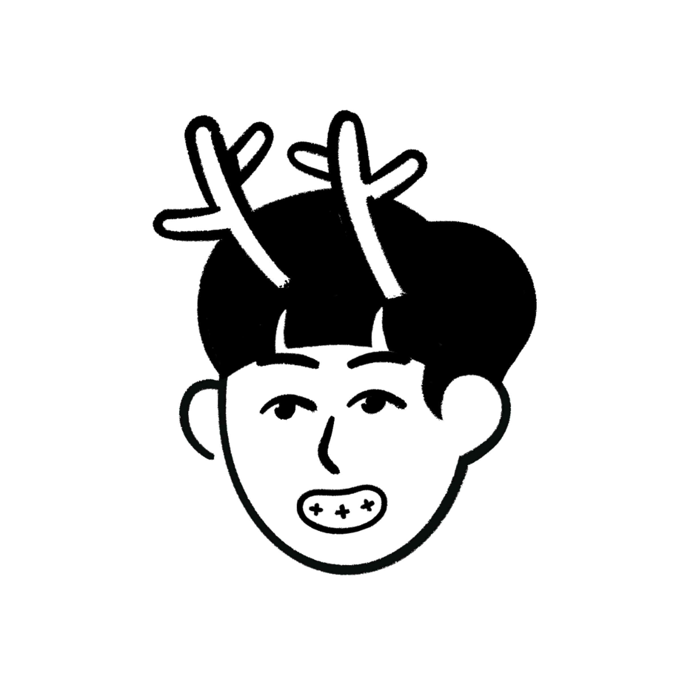

<center>

**Team Members**

|                 **김희서**                 |                    **박도연**                     |                   **이정연**                    |                   **여지원**                   |                  **임정원**                  |
|:---------------------------------------:|:----------------------------------------------:|:--------------------------------------------:|:-------------------------------------------:|:-----------------------------------------:|
|                                    |  |  |  |                                           | 
| [dearHS](https://github.com/hs03290811) |      [dp44rk](https://github.com/dp44rk)       |  [yeonnnnni](https://github.com/yeonnnnni)   |     [yjione](https://github.com/yjione)     | [jeongwon](https://github.com/garden0324) |

</center>

# 🧠 프로젝트 구조 개요 (OOAD + MVC 기반)
```
src/
├── model/
│   ├── Horse.java
│   ├── Node.java
│   ├── DiceManager.java
│   ├── YutResult.java
│   └── TurnManager.java
├── view/
│   ├── BoardPanel.java
│   ├── DicePanel.java
│   └── MainFrame.java
├── controller/
│   ├── GameManager.java
│   ├── GameController.java
│   └── Board.java
├── App.java

```
## 📁 src/model/
- Horse: 말 객체, 위치 및 상태 저장
- Node: 판 위의 위치 노드 구조
- DiceManager: 주사위 결과 생성 및 변환
- YutResult: 윷 결과 Enum
- TurnManager : 턴 관리 전담 클래스

## 📁 src/view/
- BoardPanel: 윷판 UI 구성 (GridLayout)
- DicePanel: 주사위 던지기 UI 구성
- MainFrame : 전체 UI 창

## 📁 src/controller/
- GameManager: 게임의 시작~종료 흐름 제어
- GameController : 전체 게임 진행 제어
- Board : 전체 판의 상태 관리

## 🧩 클래스 책임 분리 (OOAD 적용)
- Model: 데이터를 저장하고 계산
- View: 사용자에게 보여주는 화면 구성
- Controller: 흐름을 제어하고 Model과 View 연결

> 이 구조를 통해 각 클래스가 명확하게 분리되어 유지보수 및 확장이 쉬운 구조로 설계됨.

## 📂 관련 문서
## *매서드들 구현되면 테스트 해보고 값 정리해서 업데이트 할게요*
- 📄 [게임 전체 흐름도](docs/gameflow.md)
- 📄 [시퀀스 다이어그램 초안](docs/sequence-diagram.md)
- 📄 [클래스 설계와 유스케이스 간 대응 점검](docs/classusecase.md)
- 📄 [4월 30일 테스트 시나리오](docs/4_30.md)
- 📄 [5월 1일 테스트 시나리오](docs/5_1.md)
- 📄 [5월 2일 테스트 시나리오](docs/5_2.md)
- 📄 [5월 3일 테스트 시나리오](docs/5_3.md)
- 📄 [클래스빌드 노드 연결](docs/Builder_images.md)